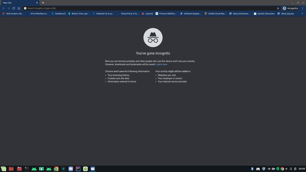

# HomeRaspberryMonitor

## Setup

Currently the CRUD API will not share raspberry Data. Pull a Postgres Docker Image for Database with:
```bash
docker run --name postgres -e POSTGRES_PASSWORD=<optional> -p 5432:5432 postgres:alpine
```
Set up for the fresh Postgres Image:
```bash
# Container ID can be checked again with: docker ps
docker exec -it <container ID>
# Only force a password with -W if you made one
psql -U postgres -W <password>
# In postgres create a new database with
CREATE DATABASE postgresdb;
# Connect to that database
\c postgresdb;
# Extension for UUID
CREATE EXTENSION "uuid-ossp";
SELECT uuid_generate_v4();
```

## Run
Open and get dependencies.

Mapping is:
localhost:8080/api/serverReport/<id>

Okta login is disable, however with it it looks like:


